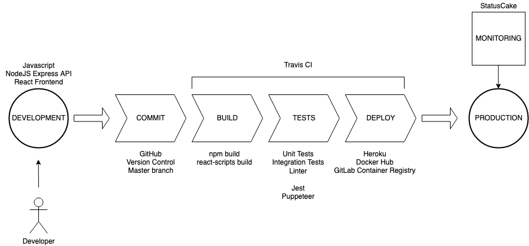

## Application build process

There is a description below how to build the application:

1.  Clone repository

        git clone https://github.com/bartoszbialecki/tester-sample-app.git

2.  Install dependencies

        yarn install-deps

3.  Start development server

        yarn dev

4.  Develop some features and push them to the server

        git add
        git commit
        git push

    You can run tests locally using `yarn test` or using linter by `yarn lint`

    Tests are written with Jest and UI tests with Puppeteer.

5.  Travis CI should detect commit on GitHub and trigger a build process

    - clone repository
    - install dependencies
    - build frontend application (`yarn build`)
    - run linter
    - run tests
    - deploy application to Heroku

6.  If succeded, the application should be deployed on Heroku and docker image shoudl be created and deployed on docker hub and gitlab container registry, otherwise the owner of the repository should get an email from the Travis CI about a failed build

## Diagram of the process

